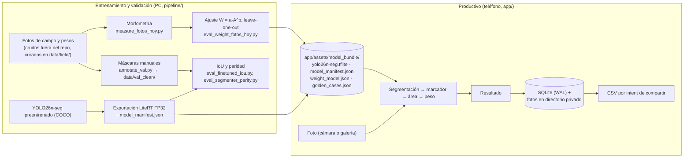

# Arquitectura de la aplicación

Wakx es un solo APK con dos flujos de datos separados. El entrenamiento y la validación ocurren en PC (`pipeline/`);
el teléfono ejecuta artefactos congelados y no necesita red. Dispositivo de referencia: Samsung Galaxy A25
(Exynos 1280, 6 GB de RAM, sin GPU aprovechable). Lo que cumple ahí cumple en el parque de teléfonos del usuario objetivo.

## Flujo de datos: entrenamiento y productivo



Del PC al teléfono solo viaja el paquete `model_bundle/`, versionado junto. Del teléfono no sale nada salvo el CSV
que el usuario decide compartir.

## Componentes

```
app/src/
├── screens/        SplashScreen, OnboardingScreen, CapturaScreen, ProcesandoScreen, ResultadoScreen, HistorialScreen
├── providers/      ModelProvider: carga y calienta el modelo al abrir la app
├── domain/         estimarPeso.ts (orquestación y rechazos), types.ts
├── vision/         image.ts (JPEG, orientación EXIF, letterbox 640×640) · tflite.ts (react-native-fast-tflite)
│                   segment.ts (máscara, vaca de mayor área) · aruco.ts (js-aruco2 a resolución fuente)
│                   morphometry.ts (área en cm²) · modelManifest.ts, config.ts (clase y hash del segmentador)
├── estimation/     bundle.ts (weight_model.json) · weightModel.ts (W = a·A^b) · interval.ts (IP 95 % log-log)
├── data/           db/schema.ts, db/dao.ts (expo-sqlite) · photos.ts (copia privada) · export/csv.ts
└── ui/, navigation/
```

Cada módulo de `vision/` y `estimation/` es espejo de uno del pipeline, mismo algoritmo en otra plataforma:

| App | Pipeline | Cómo se comprueba |
|---|---|---|
| `segment.ts` + `image.ts` | `core/segmenter_litert.py` (y `core/segmenter.py` para el `.pt`) | `tests/test_parity_a25.py`: mismas detecciones y área en 10 fotos medidas en el A25 |
| `aruco.ts` | `core/aruco.py` + `core/calibration.py` | `eval_aruco_parity.py`: escala js-aruco2 vs OpenCV |
| `morphometry.ts` | `core/morphometry.py` | Área en cm² a partir de la misma máscara y escala |
| `weightModel.ts` + `interval.ts` | `eval_weight_campana.py` (mismo bundle y golden) | `npm run test:golden`: 10 casos de peso e intervalo con tolerancia 1e-8 kg |
| `modelManifest.ts` | `make_model_manifest.py` | `tests/test_export_contract.py`: sha256 del `.tflite` = manifiesto |

## Paquete de peso (`weight_model.json`)

| Campo | Contenido |
|---|---|
| `a`, `b` | Coeficientes de W = a·A^b con A en cm². Bundle vigente `campana-994d9c2cd1a6`: a = 2.3410, b = 0.5347, ajuste log-log sobre una fotografía por animal (la primaria o, si la ruta la rechazó, la siguiente aceptada del orden de preselección) de la campaña del 12 de septiembre de 2026 con pesos de cinta del 20 de septiembre, n = 40, LOO por animal (`informes/campana_20260912/peso/`). |
| `interval` | `kind = loglog_prediction`, `level = 0.95`, `n`, `x_mean` y `sxx` (media y suma de cuadrados de ln A en el ajuste), `sigma_log`, `t_critical`, `area_min`, `area_max`. La app calcula para cada estimación `h = t_critical · sigma_log · √(1 + 1/n + (ln A − x_mean)² / sxx)` y los límites `peso · e^(−h)` y `peso · e^(h)`; fuera de `[area_min, area_max]` el resultado se marca como extrapolación. `interval = null` significa que el bundle no define intervalo y la pantalla lo dice. |
| `version`, `fuente` | Identificador del ajuste (digest de las referencias y de las fotografías que entran) y su procedencia; `version` entra en `version_modelo`. |
| `calibration` | Fecha de las fotografías, fechas e instrumentos de referencia, ruta de medida, animales y sha256 de las fuentes. Informativo: la app no lo lee. |

`golden_cases.json` fija 10 áreas con su peso y sus dos límites esperados (tolerancia 1e-8 kg) y `npm run test:golden`
los reproduce con el mismo código que la app. Cada estimación se guarda con
`version_modelo = peso:campana-994d9c2cd1a6;seg:14b35a7ba712f8b0`.

## Secuencia foto → peso

```mermaid
sequenceDiagram
  actor U as Usuario
  participant P as Pantallas
  participant O as estimarPeso.ts
  participant S as segment.ts (LiteRT)
  participant A as aruco.ts
  participant W as weightModel.ts
  participant DB as SQLite
  U->>P: foto (cámara o galería)
  P->>O: estimar(foto)
  O->>S: segmentar (640×640, clase 19, conf ≥ 0.5)
  S-->>O: máscara y caja de la vaca de mayor área, o "sin vaca"
  O->>A: buscar marcador ID 0 a resolución fuente
  A-->>O: cm/px, o "sin marcador" / "marcador ilegible"
  O->>W: área (cm²)
  W-->>O: peso = a·A^b
  O-->>P: peso, silueta y recuadro, o rechazo con causa
  U->>P: guardar con arete
  P->>DB: animal; estimacion(peso_kg, area_cm2, version_modelo, ruta_foto)
```

Se segmenta antes de leer el marcador porque en el A25 cuesta 0.45 s frente a 1.4 s con fotografías de 1280×960: una
foto sin vaca se rechaza antes de pagar lo caro. Con esas fotografías el tiempo total es ≈ 2.0 s. Con los originales
de 12 MP que produce el teléfono, la compilación de entrega tarda una mediana de 25.5–29.1 s por fotografía aceptada y
de 13.2–16.0 s por rechazo (el rechazo temprano se conserva: ArUco no se ejecuta), tiempo dominado por la
decodificación JPEG y por ArUco en JavaScript; la inferencia es ≈ 0.55 s (`informes/benchmark_release_a25_20260919/`).
Arranque en frío 3.97 s, por eso el modelo se carga al abrir la app y no al tomar la foto.

## Decisiones y evidencia

| Decisión | Elección | Evidencia |
|---|---|---|
| Formato del modelo | LiteRT FP32 (12 MB) | Segmentación p50 456 ms, p95 470 ms en el A25 (`informes/benchmark_a25_20260826_fullres.json`), margen 5.5× sobre el umbral de 2.5 s. IoU 0.985 frente al `.pt` en 35 fotos de campo. La variante w8a32 (3.5 MB) valida en PC (IoU 0.983) pero falla en el runtime móvil (LiteRT 1.4.0, react-native-fast-tflite 3.0.1); INT8 completo exigiría calibración y revalidar el MAPE. |
| Resolución de entrada | 640×640 | Es el punto de operación con el que se validó el sistema (IoU 0.86, MAPE 7.71 %). Entrar a 960–1280 cuadruplica píxeles y latencia sin evidencia de necesidad. |
| Lectura del marcador | js-aruco2 a resolución fuente | `react-native-fast-opencv` no expone `aruco`. A 960 px la escala salía +1.2 % (esquinas enteras sobre marcadores de 55–64 px); a resolución fuente, +0.63 % media y 0.82 % máximo, 10 de 10 decodificados, ≈ 1.4 s (`pipeline/src/eval_aruco_parity.py`). En producción la cámara entrega marcadores de 180–250 px. |
| Segmentador | YOLO26n-seg preentrenado en COCO | El afinado empeora sobre las 40 máscaras manuales: IoU 0.725 frente a 0.851 (`pipeline/FINETUNING.md`). La ruta del APK da IoU 0.868 y elige la vaca correcta en 38 de 40 (`informes/iou_val_manual_apk_20260909/`). |
| Varias vacas en cuadro | La de mayor área | 38 de 40 sobre las manuales; ninguna regla basada en el marcador mejora (`informes/seleccion_vaca_20260910/`). |
| Stack | React Native + Expo, inferencia por JSI | El núcleo de inferencia corre en C++ nativo vía JSI en cualquier stack, así que el rendimiento no depende de la elección; React Native reutiliza los módulos ya validados en `app-benchmark/`. |
| Almacenamiento | expo-sqlite y directorio privado de la app | Sin nube, cuentas ni telemetría (RNF-01, RNF-06). Exportación solo por intent de compartir (RF-11). |
| Trazabilidad del modelo | `model_manifest.json` y `version_modelo = peso:<versión>;seg:<sha256[0:16]>` | El hash real del `.tflite` coincide con el manifiesto y con cada fila de SQLite y del CSV; probado en el A25 (`informes/trazabilidad_a25_20260910/`). |

## Coherencia instrumental

El modelo de peso se ajustó con áreas medidas por el pipeline, así que la app debe medir igual. Emulación de la ruta
del APK en PC frente al A25: mismas detecciones en 10 de 10 fotos, área −0.014 % media, |máx| 0.205 %. `.pt` frente
a LiteRT: −0.25 % media, ≤ 0.62 % en fotos 4:3 (`informes/paridad_segmentador_20260909/`). La app es el instrumento
de referencia; el `.pt` es su aproximación en PC.

## Almacenamiento

| Dato | Dónde | Notas |
|---|---|---|
| Fotos crudas de campo (ráfagas) | Fuera del repositorio: `Thesis_final_raw/` con `MANIFEST.sha1` | Los scripts las toman de `--raw` o `$BOVINO_RAW_GROUPED` |
| Fotos curadas, pesos, morfometría, validación manual | `pipeline/data/field/`, `pipeline/data/val_clean/` | Versionados (`README_DATASETS.md`) |
| Dataset YOLO-seg | `pipeline/data/field/seg_dataset/` | Generado por el builder; no se versiona |
| Modelos | `pipeline/models/` (no versionados; `models/README.md` con sha256) y `app/assets/model_bundle/` (versionado) | |
| Estimaciones del usuario | `files/SQLite/wakx.db` (WAL): tablas `animal` y `estimacion` | Copiar `.db`, `-wal` y `-shm` para leerla fuera del teléfono |
| Fotos confirmadas | `files/wakx-fotos/` (directorio privado de la app) | No entran a MediaStore |
| Exportación | CSV por intent de compartir | Único dato que sale del dispositivo |

## Requisitos no funcionales verificados en el A25

| Requisito | Verificación |
|---|---|
| RNF-01 sin conexión | Ningún módulo de red en el flujo de estimación; modelo y coeficientes dentro del APK |
| RNF-02 ≤ 3 s por foto | **No se cumple con originales de 12 MP**: mediana 25.5–29.1 s por fotografía aceptada en la compilación de entrega (JPEG ≈ 55 %, ArUco ≈ 40 %, inferencia ≈ 2 %; `informes/benchmark_release_a25_20260919/`). Con fotografías de 1280×960: ≈ 2.0 s (segmentación 0.45 s + marcador 1.4 s + postproceso) |
| RNF-04 APK razonable | Modelo 12 MB |
| RNF-06 privacidad | Datos en SQLite y directorio privado; salen solo por CSV compartido |
| Compatibilidad | `minSdkVersion` 24, valor por defecto de la plantilla de Expo 57 que declara el APK release (`sdkVersion:'24'`) |
